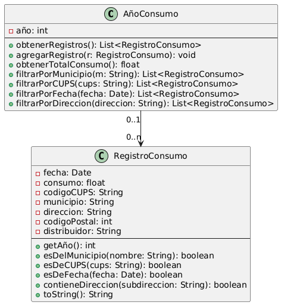
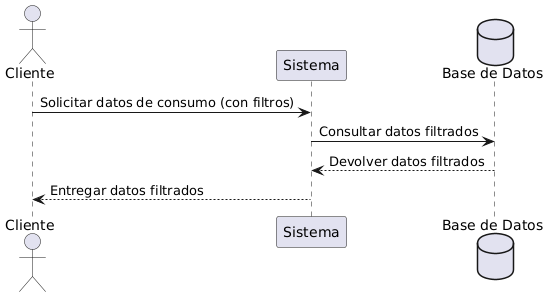
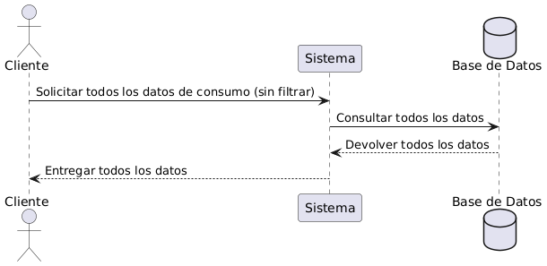
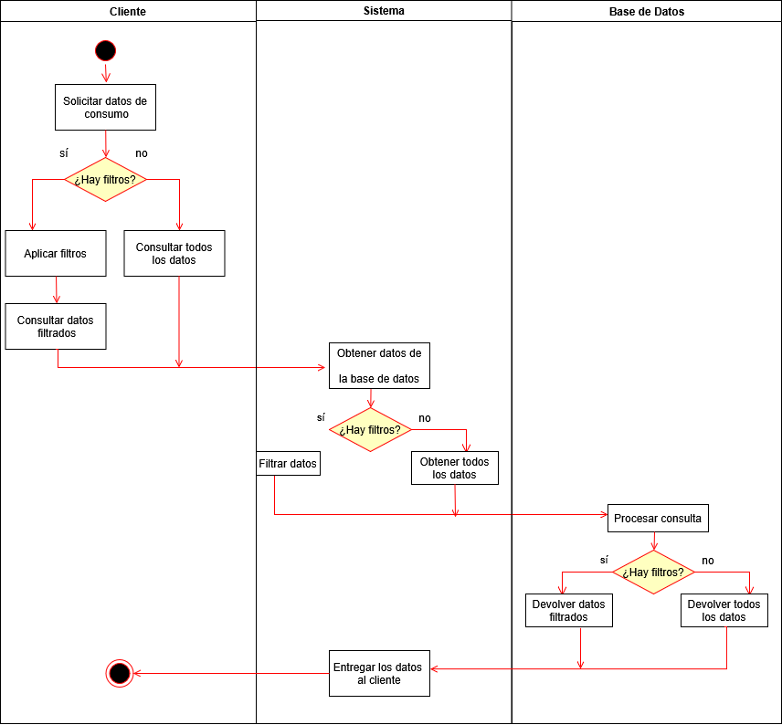

# 💡 Consumo Energético del Cabildo de Tenerife

Aplicación web informativa que permite visualizar el consumo energético de los edificios del Cabildo de Tenerife. Los usuarios pueden consultar datos históricos, aplicar filtros y obtener estadísticas relevantes para la gestión energética.

📊 **Fuente de datos oficial**:  
https://datos.tenerife.es/es/datos/conjuntos-de-datos/consumo-energetico-del-cabildo-de-tenerife

---

## ⚙️ Funcionalidades implementadas

* Visualización del consumo energético por año, mes y día.
* Tabla interactiva con filtros combinables por municipio, CUPS*, dirección, fecha y consumo energético. 
* Filtro por consumo mínimo y/o máximo, sin necesidad de completar ambos campos.
* Filtro de fechas flexible: permite introducir solo el año, año y mes, o fecha completa.
* Tooltips informativos integrados en cada filtro, compatibles con dispositivos móviles.
* Gráficos dinámicos generados con Chart.js según los filtros aplicados.
* Paginación personalizada con selección directa de página.
* Resúmenes automáticos de consumo: día, mes y año con mayor y menor consumo.
* Carga dinámica de datos desde archivos JSON públicos alojados en GitHub.
* Interfaz responsive adaptada con Bootstrap 5.
* Aplicación 100 % en cliente: no requiere instalación ni backend.

🪧CUPS (Código Universal del Punto de Suministro): Identificador único del punto donde se mide el consumo.
---

## 🚧 Funcionalidades en desarrollo

* 🖨️ **Impresión personalizada** de los contenidos filtrados (tabla, gráficos y resúmenes).
Perfecto. Si estás trabajando en un rediseño compacto y adaptable, lo ideal es reflejar que la aplicación está **en proceso de optimización para todos los tamaños de pantalla**, no solo móviles. Aquí tienes el bloque **ajustado profesionalmente** para dejarlo claro:

---

## ▶️ Abrir la aplicación

Este proyecto **no requiere instalación ni servidor local**. Puedes visualizarlo de dos formas:

1. 🌐 **Acceso a la versión en línea**

Puedes ver una **versión temporal del proyecto** desplegada desde la rama `desarrollo` a través de **GitHub Pages** en el siguiente enlace:

🔗 [https://dalilaarmas.github.io/proyecto\_dual/](https://dalilaarmas.github.io/proyecto_dual/)

Esta página se genera automáticamente con GitHub Pages para facilitar la visualización del proyecto sin necesidad de descargar ni configurar nada localmente.

2. **Desde tu ordenador (modo local)**  
   También puedes ejecutar la aplicación en local **sin necesidad de instalar nada** ni configurar un servidor web.  
   Para ello, debes seguir estos pasos:

   - Descarga el repositorio completo (no solo el archivo `index.html`), ya que el proyecto utiliza rutas relativas para acceder a scripts, hojas de estilo e imágenes dentro de la carpeta `resources/`.
   - Abre el archivo `index.html` haciendo doble clic desde el explorador de archivos de tu sistema operativo.
   - La aplicación funcionará correctamente si mantienes la estructura de carpetas original del proyecto.

   **No necesitas tener los archivos `.json` descargados localmente.**  
   Los datos se cargan automáticamente desde enlaces públicos de GitHub mediante `fetch()`, por lo que **es imprescindible tener conexión a internet** para que la aplicación funcione correctamente.

> ⚠️ Si solo descargas el archivo `index.html` sin las carpetas `resources/js` y `resources/css`, la aplicación no se mostrará correctamente porque no encontrará los archivos necesarios.  
>
> ⚠️ Si haces clic sobre `index.html` desde el navegador en GitHub, solo verás el código fuente, no la página web en funcionamiento.

---

## 🧭 Guía de uso de la aplicación

A continuación se explican las secciones principales y cómo utilizar sus herramientas:

### 🔍 Filtros disponibles

Puedes aplicar varios filtros a la vez para acotar los resultados. Los filtros se encuentran en la cabecera de la tabla, y se despliegan al hacer clic en el icono de filtro correspondiente.

#### 📌 Municipio / CUPS / Dirección

* ✏️ Introduce **al menos 3 caracteres** para que el filtro empiece a funcionar.
* 🔄 Puedes combinar estos campos con los demás filtros.

#### 📅 Fecha

* Permite buscar con distintos niveles de detalle:

  * Solo el **año**: `2023`
  * Año y mes: `2023-05`
  * Fecha completa: `2023-05-15`
* Puedes escribir solo el campo "Desde", solo el campo "Hasta" o ambos.

#### ⚡ Consumo (kWh)

* Puedes usar:

  * Solo **mínimo**
  * Solo **máximo**
  * O **ambos** para establecer un rango
* Deja vacío cualquiera de los dos campos si solo quieres un límite.

---

#### ℹ️ Tooltips informativos

* Junto a cada filtro encontrarás un icono `ℹ️` que muestra una breve explicación sobre su funcionamiento.
* Puedes consultarlo:

  * **En ordenador:** pasando el cursor o haciendo clic.
  * **En dispositivos táctiles:** tocando el icono con el dedo.

---

### 📊 Gráfica de consumo

* Representa el total de consumo según los filtros aplicados.
* Se actualiza automáticamente.
* Puedes **ocultarla o mostrarla** con el botón "Ocultar gráfica".

---

### 🧾 Resumen general

* Muestra los siguientes datos clave:

  * Día de mayor y menor consumo
  * Top 3 días con mayor y menor consumo global
  * Año con más y menos consumo
  * Mes con menor consumo global
* Siempre se muestra junto a la gráfica en pantallas grandes.

---

### 📅 Tarjetas anuales

* Cada año tiene su propia tarjeta con:

  * Consumo total
  * Promedio mensual
  * Mes con mayor consumo
* Incluye un botón para **mostrar u ocultar los detalles mensuales**.
* Se pueden **ocultar todas las tarjetas** desde el botón general.

---

### 📋 Tabla de datos

* Muestra los registros individuales tras aplicar los filtros.
* Incluye paginación con control para ir a una página concreta.
* El contenido se adapta automáticamente al tamaño de la pantalla.

---

## 🛠️ Tecnologías utilizadas

- **HTML5, CSS3 y JavaScript** – Estructura, estilos y lógica.
- **Bootstrap 5** – Diseño responsive y componentes visuales.
- **Bootstrap Icons** – Iconos vectoriales en la interfaz.
- **Chart.js** – Visualización gráfica de datos.
- **jQuery** – Gestión de eventos y manipulación del DOM.
- **Fetch API** – Carga dinámica de archivos JSON desde GitHub.

---

## 📁 Estructura del proyecto

/resources

├── /js → Scripts de filtrado, renderizado, gráficos y paginación

├── /css → Estilos personalizados sobre Bootstrap

├── /json → Archivos JSON con datos de consumo energético

└── /imagenes/diagramas → Diagramas UML explicativos

index.html → Página principal de la aplicación
README.md → Documentación del proyecto

---

## 🧩 Diagramas UML

Para entender el diseño y funcionamiento del sistema, se incluyen los siguientes diagramas:

### 🧱 Diagrama de Clases
Representa las estructuras de datos utilizadas (consumo, registros, atributos clave).

### 🔁 Diagramas de Secuencia
Explican el flujo de interacción entre los componentes:

- **Con filtros:**  
  

- **Sin filtros:**  
  

### 🔄 Diagrama de Actividad
Muestra el flujo lógico general de funcionamiento de la aplicación:

